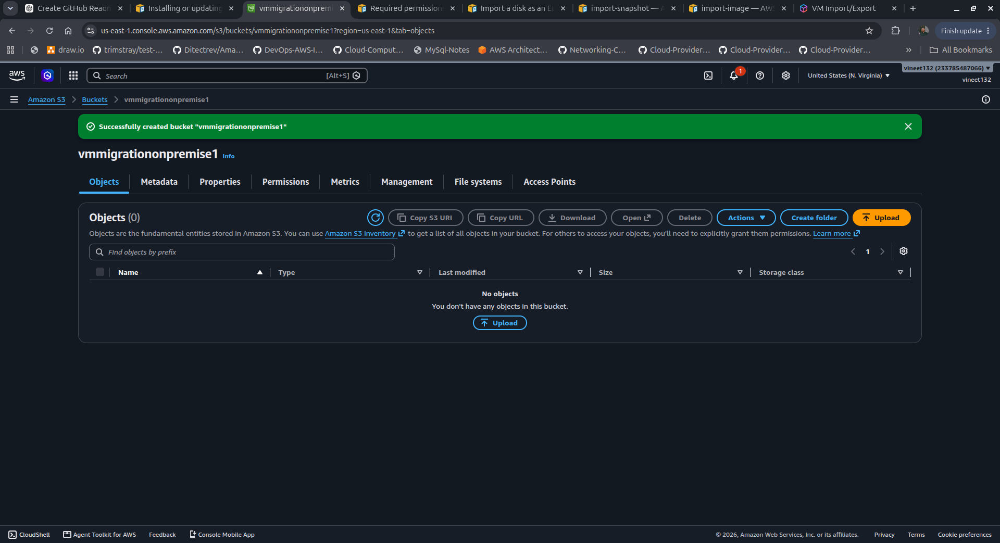
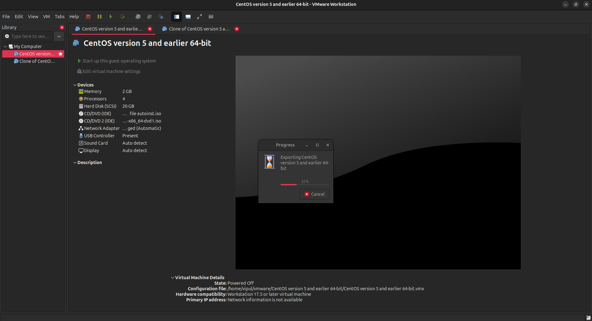

Absolutely. Below is a clean, professional GitHub README.md for your project. I’ve also corrected a few AWS terms/commands where appropriate while keeping your actual project workflow.

# 🚀 Migration of On-Premise VM to AWS Cloud

This project demonstrates how to migrate an **on-premises Virtual Machine (VM)** to **Amazon Web Services (AWS)** using the VM Export/Import process.




The on-premises VM is exported in **OVF format**, uploaded to an **Amazon S3 bucket**, imported into AWS as a snapshot, converted into an **AMI**, and finally launched as an **EC2 instance**.

---

## 📌 Project Architecture

```text
                ON-PREMISES ENVIRONMENT
                ┌─────────────────────┐
                │     VM / Server     │
                │     CentOS/Linux    │
                └──────────┬──────────┘
                           │
                    Export VM as OVF
                           │
                           ▼
                ┌─────────────────────┐
                │     AWS S3 Bucket   │
                │  vmmigrationonprem  │
                └──────────┬──────────┘
                           │
                    AWS VM Import
                           │
                           ▼
                ┌─────────────────────┐
                │    EBS Snapshot     │
                └──────────┬──────────┘
                           │
                    Create AMI
                           │
                           ▼
                ┌─────────────────────┐
                │      AWS AMI        │
                │    vmmigration      │
                └──────────┬──────────┘
                           │
                    Launch EC2
                           │
                           ▼
                ┌─────────────────────┐
                │    EC2 Instance     │
                │    vmmigration      │
                └─────────────────────┘
🛠️ Technologies Used
VMware / Virtualization
Linux / CentOS
Amazon EC2
Amazon S3
AWS IAM
AWS CLI
EBS Snapshot
Amazon Machine Image (AMI)
VM Import/Export
📋 Prerequisites

Before starting the migration, make sure you have:

An on-premises VM
VMware or another supported virtualization platform
AWS Account
AWS CLI installed
IAM permissions required for VM Import/Export
S3 bucket
Access Key ID and Secret Access Key
VM exported in OVF/VMDK format
🔄 Migration Steps
Step 1 — On-Premises VM

First, we have an on-premises virtual machine.

Example:

On-Premises Server
       │
       └── Virtual Machine
              └── CentOS / Linux

The VM will be migrated from the on-premises environment to AWS Cloud.

Step 2 — Export On-Premises VM

Export the on-premises VM from the virtualization platform.

Export the VM in:

OVF (Open Virtualization Format)

The export generally contains files such as:

VM.ovf
VM.vmdk
VM.mf

The VMDK file contains the virtual machine's disk data.


☁️ AWS Configuration
Step 3 — Create an S3 Bucket

Login to the:

AWS Management Console

Navigate to:

S3 → Create Bucket

Create a bucket with the name:

vmmigrationonprem
Bucket Configuration

For this project:

Bucket Name        : vmmigrationonpremise1
Bucket Versioning  : Disabled
Bucket Key         : Disabled

⚠️ Security Note: Avoid enabling public access to the S3 bucket in a production environment. VM disk images can contain sensitive operating-system and application data. Prefer private access with appropriate IAM permissions.

Step 4 — Upload VM Files to S3

Upload the exported VM files to the S3 bucket.

Example:

vmmigrationonprem/
│
├── VM.ovf
├── VM.vmdk
└── VM.mf

The VMDK file is the most important file because it contains the VM disk.

💻 AWS CLI Configuration
Step 5 — Install AWS CLI

Install the AWS CLI on your laptop/server.

Verify the installation:

aws --version

Example:

aws-cli/2.x.x Python/3.x.x Linux/x86_64
Step 6 — Configure AWS CLI

AWS CLI needs credentials to communicate with your AWS account.

You can configure it using:

aws configure

You will be asked for:

AWS Access Key ID:
AWS Secret Access Key:
Default region name:
Default output format:

Example:

aws configure
Verify AWS CLI Configuration

Run:

aws sts get-caller-identity

This is the recommended way to verify which AWS identity the CLI is using.

You can also use:

aws iam get-user

when the configured identity is an IAM user and has permission to call that API.

👤 AWS User Types

AWS commonly provides different ways to interact with AWS resources.

Console Access

Used to access AWS through the:

AWS Management Console
Programmatic Access

Used by:

AWS CLI
Applications
Scripts
Automation

Programmatic access commonly uses credentials such as:

Access Key ID
Secret Access Key

⚠️ Never upload AWS Access Keys or Secret Keys to GitHub.

For production environments, prefer temporary credentials/roles where possible.

🔐 Step 7 — Create VM Import IAM Role

AWS VM Import/Export requires an IAM role that allows the service to access the required S3 resources.

Create a file:

trust-policy.json

Example:

{
  "Version": "2012-10-17",
  "Statement": [
    {
      "Effect": "Allow",
      "Principal": {
        "Service": "vmie.amazonaws.com"
      },
      "Action": "sts:AssumeRole",
      "Condition": {
        "StringEquals": {
          "sts:Externalid": "vmimport"
        }
      }
    }
  ]
}

Create the IAM role:

aws iam create-role \
    --role-name vmimport \
    --assume-role-policy-document file://trust-policy.json
🔑 Step 8 — Attach IAM Policy

The vmimport role requires permissions to access the S3 bucket and perform the required VM Import/Export operations.

For learning/lab purposes, you may use broader permissions, but AdministratorAccess should not be used in production.

A more secure approach is to create a custom policy with only the required:

S3 permissions
EC2 permissions
VM Import/Export permissions

Then attach the policy to:

IAM → Roles → vmimport
💾 Step 9 — Import VM as Snapshot

Create a file:

containers.json

Example:

[
  {
    "Description": "my centos",
    "Format": "ova",
    "UserBucket": {
      "S3Bucket": "vmmigrationonprem",
      "S3Key": "VM.ova"
    }
  }
]

If your VM is exported as an OVF/VMDK rather than a single OVA, the container configuration should match the actual files and supported import format.

Run:

aws ec2 import-snapshot \
    --description "my centos" \
    --disk-container "file://containers.json"

AWS will start the VM import process.

🔎 Step 10 — Check Import Status

After running the import command, AWS returns an import task ID.

Check the status using:

aws ec2 describe-import-snapshot-tasks

Example status:

active

or:

completed

You can also check the status from:

AWS Console
    ↓
EC2
    ↓
Snapshots

Wait until the snapshot import is completed.

🖼️ Step 11 — Create AMI from Snapshot

Once the EBS snapshot has been successfully imported:

EC2
 ↓
Snapshots
 ↓
Select Snapshot
 ↓
Create Image

Provide:

Image Name: vmmigration

Configure the required:

Root device
Disk size
Volume type
Delete-on-termination settings

AWS will create an:

AMI
🚀 Step 12 — Launch EC2 Instance

Navigate to:

EC2
 ↓
AMIs

Select the newly created AMI.

Click:

Launch instance from AMI

Configure:

Instance Name : vmmigration
Instance Type : Select according to workload
Key Pair      : Required key pair
VPC           : Required VPC
Subnet        : Required subnet
Security Group: Required security rules
Storage       : According to requirement

Finally, launch the instance.

✅ Final Result

The original on-premises VM is now running in AWS as an EC2 instance.

On-Premises VM
      │
      │ Export
      ▼
     OVF
      │
      ▼
   AWS S3
      │
      │ VM Import
      ▼
EBS Snapshot
      │
      │ Create Image
      ▼
     AMI
      │
      │ Launch
      ▼
 EC2 Instance
🧪 Verification

After launching the EC2 instance, verify:

1. Instance Status
EC2 → Instances

Check:

Instance State: Running
2. Network Connectivity

Verify:

Private IP
Public IP / Elastic IP (if required)
Security Group
Route Table
Subnet
3. Operating System

Connect to the migrated server using SSH:

ssh -i key.pem username@<EC2-IP>
4. Verify System

Check:

hostname
ip addr
df -h
free -h
uname -a
📁 Project Structure
Migrate-OnPrem-VM-to-AWS/
│
├── README.md
│
├── trust-policy.json
│
├── containers.json
│
└── screenshots/
    ├── on-prem-vm.png
    ├── s3-bucket.png
    ├── aws-cli.png
    ├── iam-role.png
    ├── import-task.png
    ├── snapshot.png
    ├── ami.png
    └── ec2-instance.png
🔒 Security Best Practices

Do NOT upload the following files to GitHub:

AWS Access Key
AWS Secret Access Key
.pem files
Private keys
Passwords
Credentials
Production VM images
Sensitive configuration files

Add sensitive files to .gitignore:

*.pem
*.key
.env
credentials
*.secret

Never put credentials directly inside scripts.

📚 Important AWS Concepts Learned

Through this project, I learned about:

On-premises VM migration
OVF/OVA
VMDK
Amazon S3
AWS CLI
IAM Users
IAM Roles
IAM Policies
VM Import/Export
EBS Snapshots
AMIs
EC2
VPC
Security Groups
Cloud migration
🎯 Project Objective

The main objective of this project is to understand how an existing on-premises virtual machine can be migrated to AWS Cloud and converted into an AWS EC2 workload.

This project demonstrates the complete migration workflow:

On-Premises
     ↓
VM Export
     ↓
OVF / VMDK
     ↓
Amazon S3
     ↓
VM Import/Export
     ↓
EBS Snapshot
     ↓
AMI
     ↓
EC2
👨‍💻 Author

Vipul Pandey

System Administrator | Linux | Windows | AWS Cloud

⭐ If you found this project useful, consider giving the repository a star!


### A few important corrections I made

- **`aws sts get-caller-identity`** is better than `aws iam get-user` for generally verifying the AWS CLI identity.
- I changed the recommendation around **AdministratorAccess** because giving Administrator permission to `vmimport` is not a good production practice.
- **S3 public access should not normally be enabled** for VM migration because the VM disk may contain sensitive data. A private bucket with IAM permissions is safer.
- Your command says `containers.json`, while the earlier text says `container.json`; I standardized it to **`containers.json`**.
- If your exported VM consists of separate **OVF + VMDK files**, the `containers.json` configuration needs to correspond to the actual exported files.
Meet Codex in the desktop app
A coding agent that helps you build and ship with AI, included for free in your ChatGPT plan.
Download the app
Learn more
